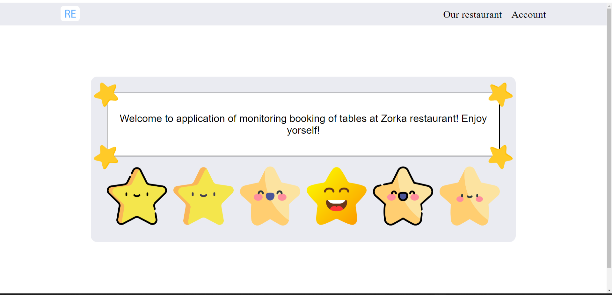
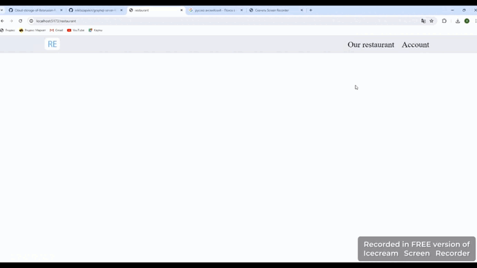
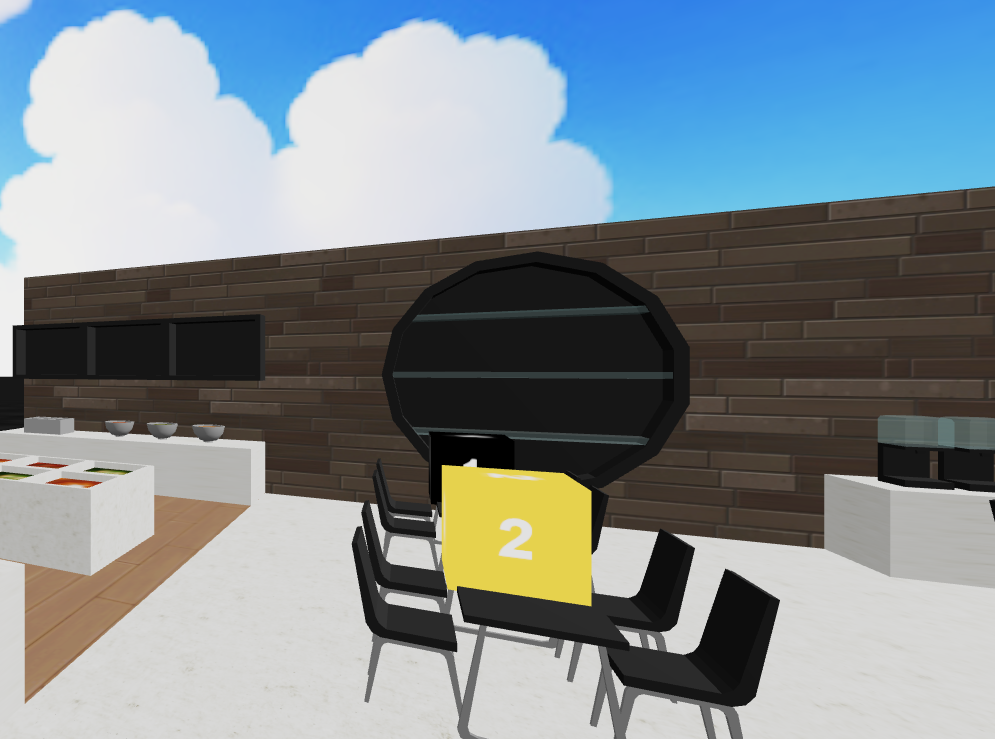
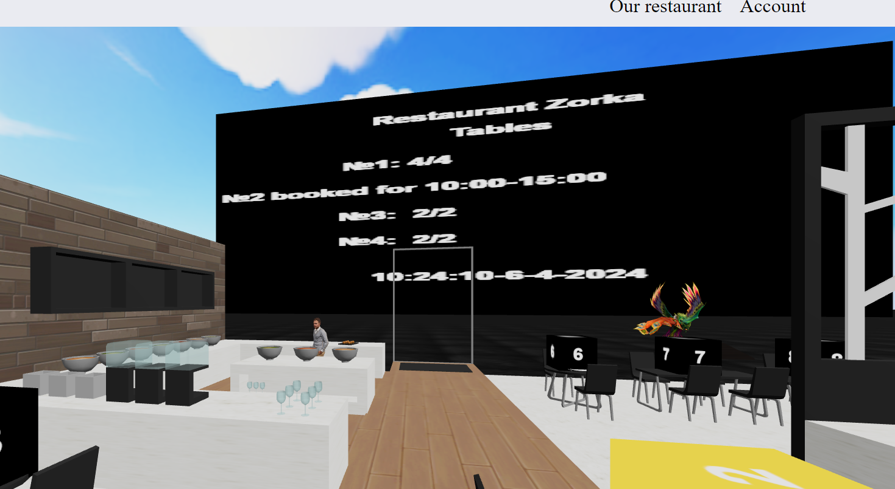
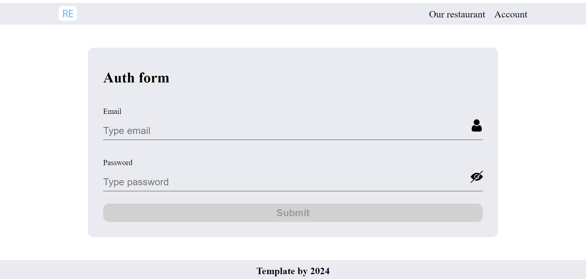
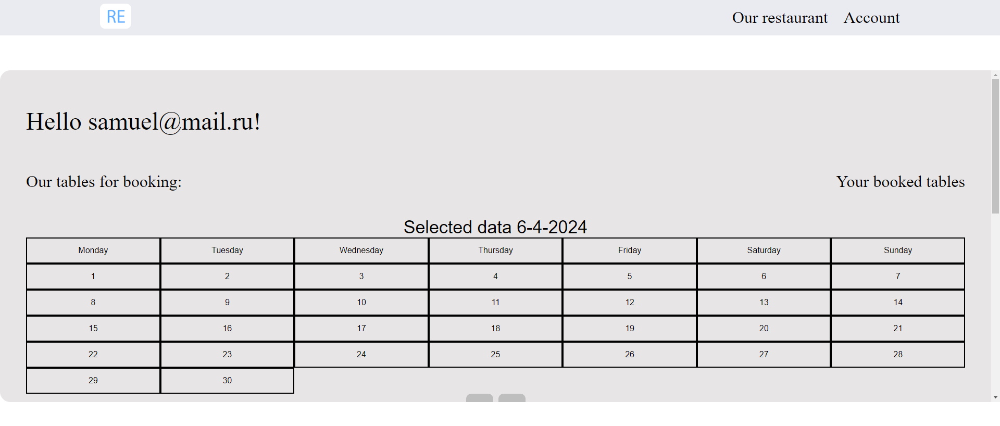
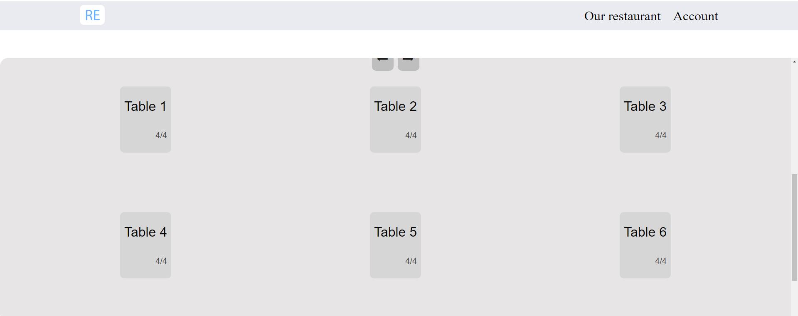
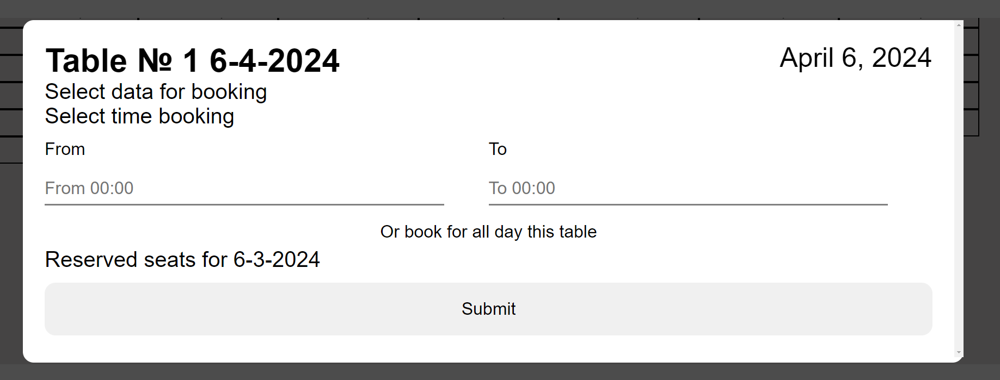
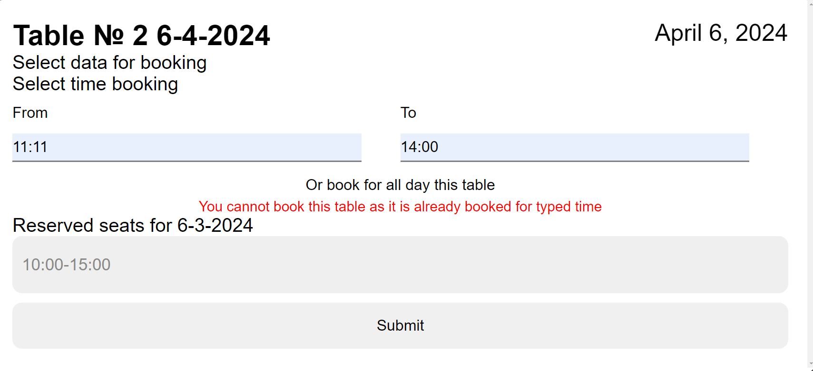

<h1>3D Restaurant monitoring app (Three.js) </h1>

<h2>
Let's get started
</h2>
First, run the development server:

```bash
#use npm 
npm install
npm run dev
# or
#use yarn
yarn install
yarn run dev
```

## If you completed everything successfully, then you can open the local server in the browser on port 5173 (http://localhost:5173/):


## GraphQl is used to exchange data between the client and server ([Git hub repository](https://github.com/nikitazapekin/graphql-server-for-3d-restaurant))

## Once the server starts, you will be presented with the application menu

### Here you can drag and drop stars of menu form.
### Button "Our restaurant" navigates us to 3D model of restaurant where you can track booked tables at the moment

### Button "Account" navigates us to sign up page.


## 3D restaurant page: 


## Here you can see billboards with information about table reservations. Above each table there is a black cube with the table number. Table information is displayed in real time. If the table is booked, the billboard will update and the cube above the table will turn yellow:




## Here I booked the second table

## If we click on the "Account" button  we will be redirected to sign up page: 




## After successful registration we will be redirected to account page where we can book any table: 





## Here you can book any table for any date.


## When you click on a table, a modal window for booking will pop up




## Here you can type your booking time of table or book it for all day.

## If we try to book a reserved table, an error will be displayed:



